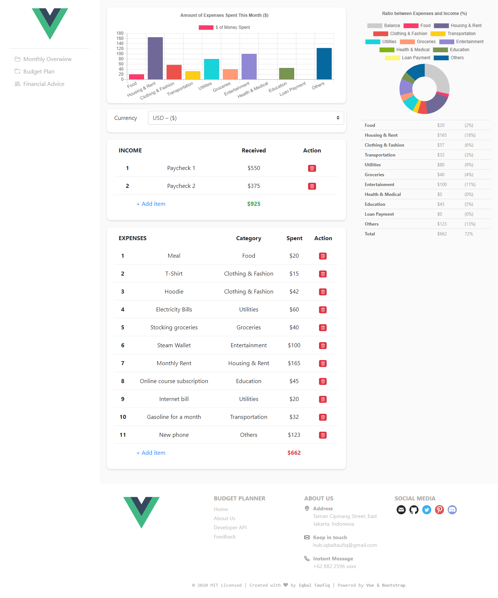

# Personal Budget Planner
[](https://www.npmjs.com/package/@vue/cli?activeTab=versions)
[](https://standardjs.com)
[](https://github.com/iqbaltaufiq/budget-planner/blob/master/LICENSE)

A tool to keep track on your expenses and see the portion of each category you're spending to.

## Background
People tend to spend their money uncontrolled and unmonitored, and it often leads into low-to-medium severity financial problem. That's because not everyone can hold their will to buy things, even unnecessary ones. That is a problem, and we hope this tool can help you make wiser decision when allocating your money.

This tool works in the same principle as a parent (or friend) -- someone who gives you insight from _"their perspective"_ whether it's okay to spend _that much_ on _that stuff_. In other words, you are looking at your expenses as a third person. Visualization helps you judge better about how big the impact your budget takes from every purchase you made.

Please keep in mind that the purpose of this tool is to help you allocate your money to the most essential category, not to make you rich. Maybe try investing your money on stock market or gold to get any return of investment.


> _"Interactive visualisation increases decision-maker confidence and accuracy in a financial decision-making context."_ [(Fengchun, 2014)](https://www.researchgate.net/profile/Ilaria_Barletta/post/What_is_the_impact_of_Information_Visualization_to_Decision_Making/attachment/59d644a1c49f478072ead59e/AS%3A273817987944453%401442294703466/download/the-impact-of-information-visualisation-on-the-quality-of-information-in-business-decision-making.pdf)


## Getting started
```bash
# clone the project
git clone https://github.com/iqbaltaufiq/budget-planner.git

# enter the project directory
cd budget-planner

# install dependencies
npm install

# run in development mode
npm run serve

# open browser and enter the address
http://localhost:8080
```

## Tech / Framework Used

#### Built with:
- [VueJS](https://vuejs.org) (CLI with babel, vuex, router, and eslint-standard)
- [BootstrapVue](https://bootstrap-vue.org) (with IconsPlugin)
- [Chart.js](https://chartjs.org)


## Features
- List all of your expenses
- Two charts that will help you visualize your expenditure
- Live updated charts
- Financial advices that can help you make better financial decision
- Available currency:
	```txt
	- Australia - AUD - ($)
	- Europe - EUR - (€)
	- India - INR - (₹)
	- Indonesia - IDR - (Rp)
	- Japan - JPY - (¥)
	- Malaysia - MYR - (RM)
	- People Republic of China - CNY - (¥)
	- Singapore - SGD - ($)
	- South Korea - KRW - (₩)
	- United Kingdom - GBP - (£)
	- United States - USD - ($)
	```


## Configuration
#### Using Dummy Datasets to Populate Data
For development purposes, you can use dummy datasets that are saved in `src/assets/js`. There are two datasets you can use to populate data, `income.js` and `expenses.js`.

In order to use it, you should go to `src/store/state.js` and import it there. We already imported it for you, so all you need to do is just _uncomment_ the code and export it as state.

Example:
```js
// filepath: src/store/state.js

import income from '@/assets/js/income.js'
import expenses from '@/assets/js/expenses.js'

export default {
  income,
  expenses,
  categories: [
    ...
  ]
}
```

## Articles
- ["The Psychological Science of Spending Money"](https://www.researchgate.net/publication/286014812_The_Psychological_Science_of_Spending_Money)
- ["Can't Stop Spending Money? These 5 Psychological Theories Could Explain Your Problem"](https://www.huffpost.com/entry/stop-spending-psychology-of-spending-money_l_5c82f987e4b08d5b7861b484)
- ["Social Facilitation"](https://www.simplypsychology.org/Social-Facilitation.html)
- ["Difference Between Needs and Wants"](https://keydifferences.com/difference-between-needs-and-wants.html)

## Screenshots


## License
MIT License

Copyright &copy; 2020 [Iqbal Taufiqurrahman](https://github.com/iqbaltaufiq)
